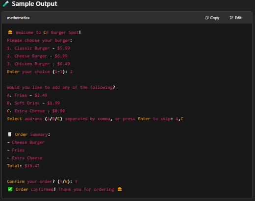

# 🍔 Burger Order App

A simple, beginner-friendly C# console app that simulates ordering a burger. It showcases:

User input handling

Nullable booleans

Console UI basics in C#

📆 Sample Output

🍔 Welcome to C# Burger Spot!
1. Classic Burger - $5.99
2. Cheese Burger - $6.99
3. Chicken Burger - $6.49
Enter your choice: 2
...etc

🚀 Run it:
```
dotnet run
```

